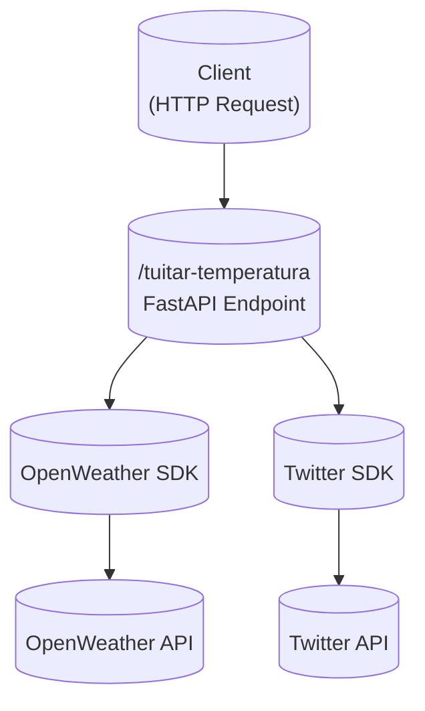

```mermaid
graph TD
    client[("Client\n(HTTP Request)")]
    api[("/tuitar-temperatura\nFastAPI Endpoint")]
    sdk_openweather[("OpenWeather SDK")]
    sdk_twitter[("Twitter SDK")]
    openweather[("OpenWeather API")]
    twitter[("Twitter API")]

    client --> api
    api --> sdk_openweather
    api --> sdk_twitter
    sdk_openweather --> openweather
    sdk_twitter --> twitter

```    